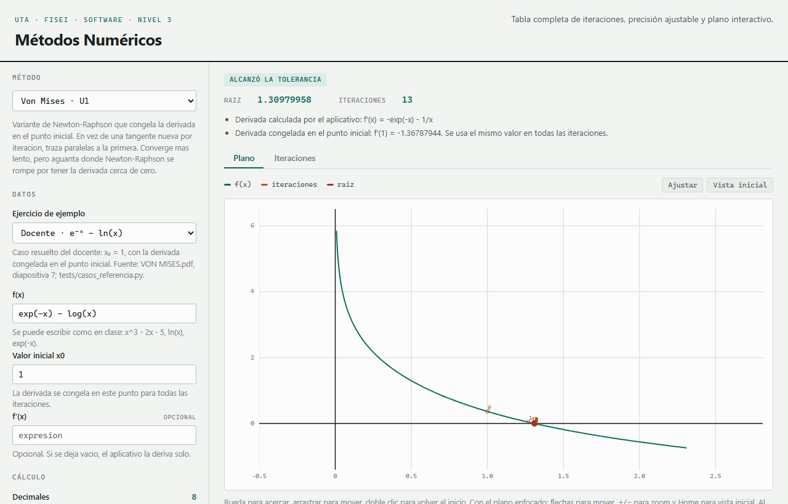
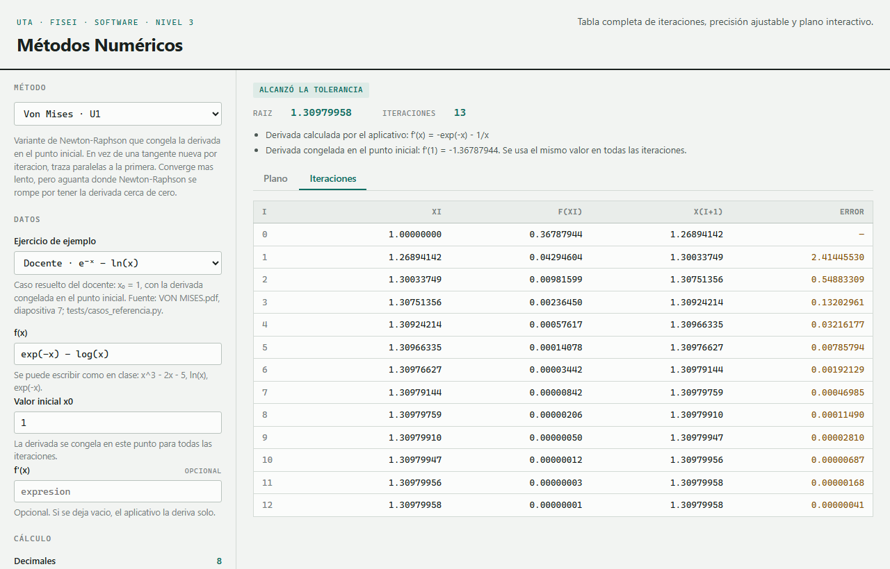
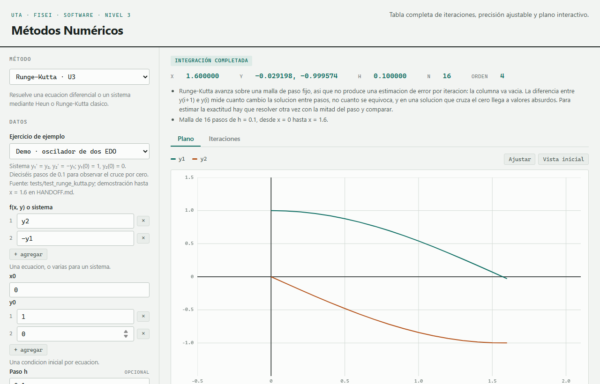

# Manual de usuario

Aplicativo de Metodos Numericos — UTA, FISEI, Software Nivel 3.

Para instalarlo, ver el [README](../README.md). Este manual es para usarlo.

La pantalla tiene dos mitades. A la izquierda se plantea el problema; a la
derecha aparece la respuesta, con dos pestanas: **Plano** e **Iteraciones**.

## 1. Elegir el metodo

El desplegable de arriba lista los metodos disponibles con su unidad. Abajo
aparece una linea que explica que hace cada uno.

| Metodo | Sirve para |
|---|---|
| Newton-Raphson | encontrar una raiz de `f(x) = 0` |
| Von Mises | lo mismo, con la derivada congelada en el punto inicial |
| Interpolacion de Newton | armar el polinomio que pasa por unos puntos, y evaluarlo |
| Runge-Kutta | resolver una EDO o un sistema de EDO |

**Cambiar de metodo borra lo que haya en pantalla.** Es a proposito: una tabla
que quedo de otro metodo se lee como si fuera del nuevo.

## 2. Cargar los datos

Hay dos formas.

**Con un ejercicio de ejemplo.** El desplegable "Ejercicio de ejemplo" carga un
problema completo de una sola vez: la funcion, el punto inicial, la precision,
el criterio de error, todo. Debajo aparece de donde salio ese ejercicio. Los
ejercicios del material del docente estan ahi.

**A mano.** El formulario se arma solo segun lo que el metodo pida. Las
casillas marcadas "opcional" se pueden dejar vacias y el metodo aplica su
criterio; las demas son obligatorias.

### Como escribir las funciones

Se escriben casi como en clase:

| Se escribe | Significa |
|---|---|
| `x^3` o `x**3` | x al cubo |
| `2x` | 2 por x |
| `exp(-x)` | e elevado a −x |
| `log(x)` | logaritmo natural (`ln`) |
| `sqrt(x)` | raiz cuadrada |
| `sin(x)`, `cos(x)`, `tan(x)` | trigonometricas |
| `pi`, `E` | las constantes |

Si algo esta mal escrito, el aplicativo lo dice en palabras —que falta un
parentesis, que uso un nombre que no existe— en vez de mostrar un error de
programa.

### Puntos, sistemas y derivadas

- **Interpolacion de Newton** pide una tabla de puntos. El boton agrega filas.
  Una fila a medio llenar se rechaza: no se convierte en el punto (0, 0).
- **Runge-Kutta** acepta un sistema. El boton agrega ecuaciones, y las
  incognitas se llaman `y1`, `y2`, ... Con una sola ecuacion la incognita se
  llama `y`. La malla se define con `h` y `n`, con `h` y `xf`, o con `n` y `xf`.
- **Newton-Raphson** deriva solo. Si se escribe la derivada en su casilla, usa
  esa. En las dos formas dice abajo cual uso.

## 3. Ajustar el calculo

| Control | Que hace |
|---|---|
| **Decimales** | Cuantos decimales se muestran. **Solo afecta la pantalla**: no se recalcula nada, y se puede mover despues de resolver. |
| **Iteraciones maximas (n)** | Cuantas iteraciones como maximo. |
| **Tolerancia** | Cuando se considera alcanzada la precision. |
| **Criterio de error** | Absoluto, relativo o relativo porcentual. El porcentual es el que usa el docente en su tabla, y es el que viene por defecto. |
| **Parar al alcanzar la tolerancia** | Destildado, corre **exactamente n iteraciones** aunque ya haya convergido. Sirve para pedir "hasta la iteracion 5" y ver las cinco filas. |

## 4. Resolver

El boton **Resolver** calcula y llena las dos pestanas.

Arriba del resultado aparece una franja de color con el motivo por el que se
detuvo:

| Franja | Significa |
|---|---|
| Alcanzo la tolerancia | Converge. |
| Solucion exacta | Cayo justo sobre la raiz. |
| Integracion completada | Runge-Kutta recorrio sus n pasos. Es el final normal. |
| Completo las n iteraciones sin alcanzar la tolerancia | Se quedo sin iteraciones. Subir n o aflojar la tolerancia. |
| El metodo diverge | Se aleja en vez de acercarse. **No hay raiz**, y el aplicativo no inventa una. Debajo explica por que. |

Debajo van las notas: que derivada se uso, cuanto vale la derivada congelada,
por que se detuvo.

### La tabla de iteraciones

Una fila por iteracion, con las columnas propias del metodo. La primera fila no
lleva error: no hay valor anterior con que compararla.

Una raya `—` significa que ese valor no existe. En Runge-Kutta **toda** la
columna de error es raya: un metodo de paso unico no produce una estimacion de
error por iteracion, y la nota lo explica.

### El plano

Es un plano de verdad, no una imagen:

- **Rueda del mouse** para acercar y alejar.
- **Arrastrar** para mover.
- **Doble clic** vuelve a la vista inicial.
- Con el plano **enfocado** (haciendo clic o con Tab): flechas para mover, `+`
  y `−` para el zoom, `Home` para volver al inicio.
- **Ajustar** encuadra todo lo dibujado; **Vista inicial** vuelve al encuadre
  original.

Al acercarse, la curva **se recalcula**: se le piden puntos nuevos al nucleo en
el rango visible. No se ve quebrada al hacer zoom, y los valores son los mismos
que los de la tabla porque los calcula el mismo codigo.

## 5. Comparar metodos

**Comparar metodos** resuelve el mismo problema con todos los metodos que
reciben los mismos datos, y arma una tabla con iteraciones, resultado, error
final y estado. En el plano se superponen las curvas de convergencia.

El caso interesante es **Newton-Raphson contra Von Mises**: misma funcion, mismo
punto inicial, y se ve para que sirve congelar la derivada y lo que cuesta.

Menos iteraciones no siempre es mejor: un metodo puede converger rapido en un
punto y romperse en otro.

## 6. Exportar

**Exportar CSV** baja la tabla completa. **Exportar PDF** baja un documento con
el metodo, la funcion, los parametros, la tabla y el resultado.

Los numeros van **sin redondear**, con toda la precision con que se calcularon.
El control de decimales es de la pantalla: redondear al mostrar se puede
deshacer, redondear al guardar no.

## Preguntas que aparecen seguido

**Puse 6 decimales y la grafica no cambio.**
Correcto. Los decimales son de la pantalla. La grafica y el CSV usan los valores
completos.

**Runge-Kutta no me muestra el error.**
Tampoco deberia. Ver arriba.

**Dice que diverge, pero el ejercicio es del profesor.**
Puede ser las dos cosas. El ejercicio de la diapositiva 10 de `VON MISES.pdf`
diverge con Von Mises y converge con Newton-Raphson: es una propiedad del
metodo, no un error del aplicativo. Se explica en
[VALIDACION.md](VALIDACION.md).

**No me aparece la interfaz, solo datos.**
Se esta pidiendo una direccion de la API en vez de la raiz. Abrir
<http://127.0.0.1:8000>.

**Necesito internet para usarlo.**
No. No hay ninguna libreria externa: funciona con la maquina desconectada.
