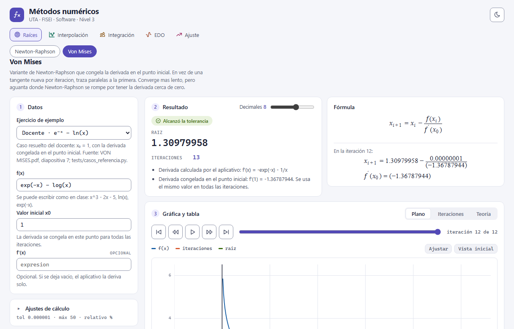
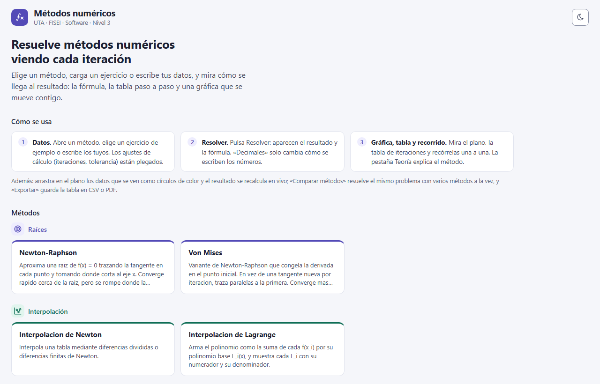
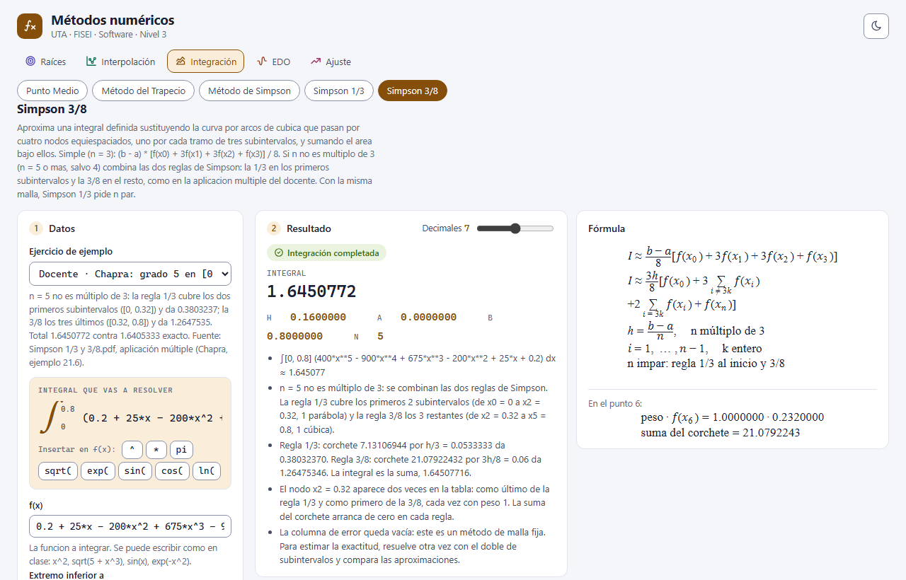
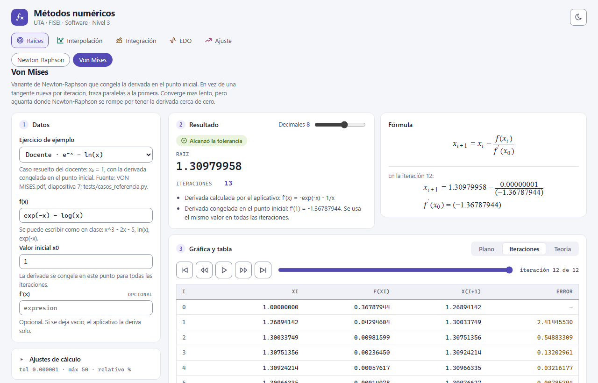
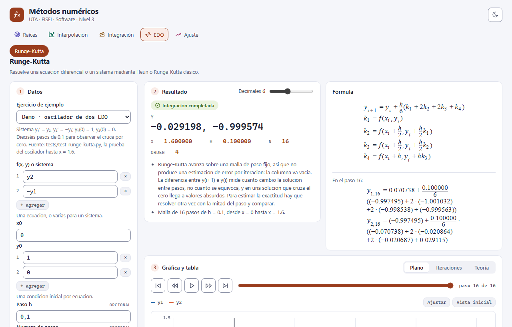
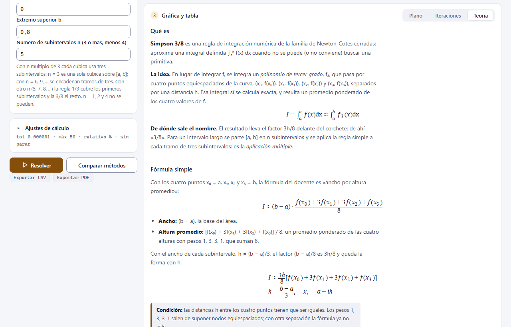
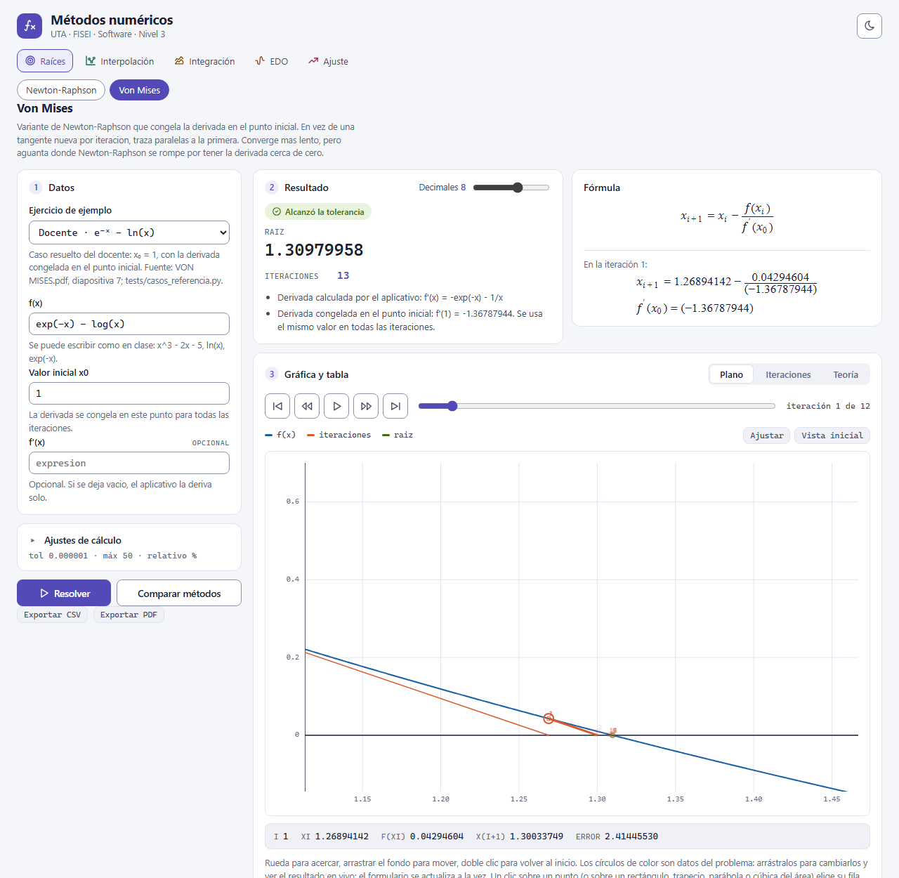
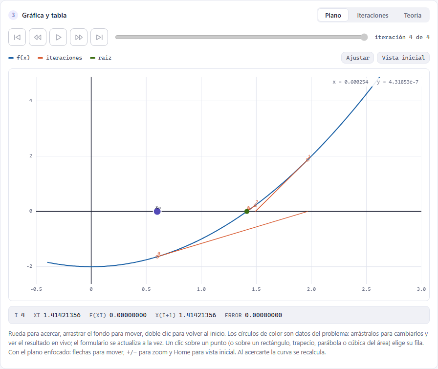

# Manual de usuario

Aplicativo de Metodos Numericos — UTA, FISEI, Software Nivel 3.

Para instalarlo, ver el [README](../README.md). Este manual es para usarlo.

El aplicativo abre en la **portada**, con una tarjeta por metodo (seccion 1).
Dentro de un metodo, arriba se elige el metodo. Debajo, la pantalla se arma en
tarjetas numeradas en el orden en que se usan: a la izquierda **1 · Datos** y
los ajustes de calculo; a la derecha **2 · Resultado**, la **Formula** del
metodo y **3 · Grafica y tabla**, con tres vistas: **Plano**, **Iteraciones** y
**Teoria**. En un celular las tarjetas van una debajo de otra, en ese mismo
orden.

El boton de la luna (o del sol), arriba a la derecha, cambia entre tema claro y
oscuro. La eleccion se recuerda; si nunca se toco, se sigue el tema del sistema.

## 1. La portada y elegir el metodo

La portada explica en tres pasos como se usa el aplicativo (datos, resolver,
grafica y tabla) y muestra una **tarjeta por metodo**, agrupadas por familia,
con su nombre y una descripcion que sale del propio metodo. Un clic en una
tarjeta abre ese metodo.

La direccion de la pagina sigue donde se esta: `#/` es la portada y
`#/metodo/<slug>` es un metodo (por ejemplo `#/metodo/simpson-38`). Por eso
funcionan **Atras** y **Adelante** del navegador, y un enlace directo a un
metodo se puede copiar y mandar. Un nombre que no existe cae en la portada. El
logo y el titulo de la cabecera vuelven a la portada desde cualquier metodo.

Dentro de un metodo, los metodos estan agrupados por familia, en pestanas:
**Raices**, **Interpolacion**, **Integracion**, **EDO** y **Ajuste**. Cada
familia tiene su color, que
tine los botones y los pasos mientras se trabaja en ella. Debajo de las
pestanas, un boton por metodo de esa familia; abajo aparece una linea que
explica que hace el elegido. Con el teclado, las flechas recorren las familias y
los metodos.

Al volver a una familia queda marcado el ultimo metodo que se uso en ella.

La tarjeta **Formula** muestra la formula del metodo en cuanto se elige, antes
de resolver, con la notacion de clase. En Runge-Kutta cambia segun el orden
(2 o 4) que se escriba en el formulario.

| Metodo | Sirve para |
|---|---|
| Newton-Raphson | encontrar una raiz de `f(x) = 0` |
| Von Mises | lo mismo, con la derivada congelada en el punto inicial |
| Interpolacion de Newton | armar el polinomio que pasa por unos puntos, y evaluarlo |
| Interpolacion de Lagrange | lo mismo, por polinomios base en vez de diferencias divididas |
| Punto Medio | aproximar una integral definida con rectangulos centrados |
| Método del Trapecio | aproximar una integral definida con segmentos rectos y trapecios |
| Método de Simpson | aproximar una integral definida con arcos de parabola, con un punto medio por subintervalo |
| Simpson 1/3 | lo mismo, con una parabola por cada dos subintervalos y `n` par |
| Simpson 3/8 | lo mismo con arcos de cubica, una por cada tres subintervalos; admite `n` que no es multiplo de 3 |
| Runge-Kutta | resolver una EDO o un sistema de EDO |
| Ajuste por minimos cuadrados | hallar la recta (o un modelo potencial, exponencial o logaritmico) que mejor sigue unos datos |

**Cambiar de metodo borra lo que haya en pantalla.** Es a proposito: una tabla
que quedo de otro metodo se lee como si fuera del nuevo.

## 2. Cargar los datos

Hay dos formas.

**Con un ejercicio de ejemplo.** El desplegable "Ejercicio de ejemplo" carga un
problema completo de una sola vez: la funcion, el punto inicial, la precision,
el criterio de error, todo. Debajo aparece de donde salio ese ejercicio. Los
ejercicios del material del docente estan ahi, junto con ejercicios de
practica (los que empiezan con "Practica"): ocho por metodo, y mas en los
metodos nuevos (diez en Simpson 1/3, trece en Simpson 3/8 y diez en el ajuste).
Cada ejercicio de practica dice en su descripcion el valor exacto o el que
da la regla, para comparar.

**A mano.** El formulario se arma solo segun lo que el metodo pida. Las
casillas marcadas "opcional" se pueden dejar vacias y el metodo aplica su
criterio; las demas son obligatorias.

### Como escribir las funciones

Se escriben casi como en clase:

| Se escribe | Significa |
|---|---|
| `x^3` o `x**3` | x al cubo |
| `2x` | 2 por x |
| `exp(-x)` | e elevado a −x |
| `log(x)` | logaritmo natural (`ln`) |
| `sqrt(x)` | raiz cuadrada |
| `sin(x)`, `cos(x)`, `tan(x)` | trigonometricas |
| `pi`, `E` | las constantes |

Si algo esta mal escrito, el aplicativo lo dice en palabras —que falta un
parentesis, que uso un nombre que no existe— en vez de mostrar un error de
programa.

### Puntos, sistemas y derivadas

- **Los dos metodos de interpolacion y el ajuste por minimos cuadrados** piden
  una tabla de puntos. El boton
  agrega filas. Una fila a medio llenar se rechaza: no se convierte en el punto
  (0, 0). **Los puntos se usan en el orden en que se cargaron**, sin ordenarlos
  por x: asi la tabla se puede comparar fila por fila con la del pizarron.
- **Interpolacion de Newton** tiene una casilla `variante`, opcional. Viene con
  `divididas`, y vacia usa lo mismo: **diferencias divididas**, que es lo que se
  ve en clase. Cada diferencia va en la fila de su ultimo punto, como en el
  pizarron, asi que los `a_i` del resumen se leen sobre la diagonal de la tabla.
  Las otras opciones (`auto`, `adelante`, `atras`) muestran la misma respuesta
  con otra tabla intermedia; `adelante` y `atras` necesitan que los x esten
  igualmente espaciados y lo avisan si no lo estan.
- **Interpolacion de Lagrange** no tiene variantes. Su tabla no son
  iteraciones: cada fila es un paso del procedimiento, con el numerador y el
  denominador de cada `L_i` escritos tal como se hacen a mano. Esas columnas
  llevan expresiones, no numeros, asi que el control de decimales no las toca.
- **Runge-Kutta** acepta un sistema. El boton agrega ecuaciones, y las
  incognitas se llaman `y1`, `y2`, ... Con una sola ecuacion la incognita se
  llama `y`. La malla se define con `h` y `n`, con `h` y `xf`, o con `n` y `xf`.
- **Punto Medio, Método del Trapecio y Método de Simpson** piden `f(x)`, los
  extremos `a`, `b` y el numero de subintervalos `n`. En los tres aparece
  arriba la integral que se va a resolver. Punto Medio evalua el centro de cada
  intervalo; Trapecio muestra sus extremos con peso 1 o 2 y los une con
  segmentos rectos.
- **Método de Simpson** pide `n` par, como el material. Con `n = 2` usa una
  sola parabola por `a`, el punto medio y `b`; con `n` mayor, `n` subintervalos
  y el punto medio de cada uno. La tabla nombra cada punto (`x0`, `m1`, `x1`,
  ...; `m` es la x con barra del material) y termina con la suma del corchete,
  que se multiplica por `(b − a)/(6n)`.
- **Simpson 1/3** pide `n` par y **Simpson 3/8** pide `n` de 3 o mas, salvo 4
  (secciones siguientes). Si `n` no sirve, el metodo dice cual es el problema y
  sugiere la otra regla.
- **Ajuste por minimos cuadrados** pide la tabla de puntos, un **modelo** en una
  lista desplegable (viene `lineal`) y, opcional, una `x` donde evaluar la curva
  ajustada.
- **Newton-Raphson** deriva solo. Si se escribe la derivada en su casilla, usa
  esa. En las dos formas dice abajo cual uso.

### Punto Medio

Para aproximar una integral con rectangulos centrados, elegir **Integracion**
y despues **Punto Medio**. El ejemplo del material del docente para el parcial
1 se puede cargar con estos datos:

| Campo | Valor |
|---|---|
| `f(x)` | `0.25*x^3 - x` |
| Extremo inferior `a` | `-1.5` |
| Extremo superior `b` | `2` |
| Numero de subintervalos `n` | `7` |

Pulsar **Resolver**. El ancho de cada subintervalo es `0.5` y el resultado es
`-0.205078125`; al elegir cuatro decimales se ve **`-0.2051`**, como en la
diapositiva del docente. El signo negativo indica que en este ejemplo pesan
mas los aportes bajo el eje x.

En **Iteraciones** aparecen siete filas, desde la 1. Cada una muestra el punto
medio, `f(xi)`, el area con signo `f(xi) * dx` y la suma acumulada. Los puntos
medios son `-1.25, -0.75, -0.25, 0.25, 0.75, 1.25, 1.75`; la ultima suma
coincide con la integral del resumen. En **Plano** se ven la curva y los siete
rectangulos, cada uno con la altura de la funcion en su centro.

La insignia **Integracion completada** indica que recorrio todos los
subintervalos. La columna de error va vacia porque el metodo no calcula una
estimacion por fila. Para comparar la aproximacion, cambiar `n` de 7 a 14 y
resolver otra vez. La integral analitica del ejemplo es `-0.19140625`;
aumentar `n` permite acercarse a ella. Cambiar **Decimales** solo cambia la
presentacion, no la precision del calculo.

`a` tiene que ser menor que `b`, y `n` debe ser un entero entre 1 y 10000.
La cantidad de rectangulos se cambia en ese campo del formulario: los ajustes
de iteraciones maximas y tolerancia no definen esta malla. Si la funcion no
esta definida en un punto medio, el aplicativo explica la causa.

### Simpson 1/3

Para el ejemplo de `Simpson1.pdf`, elegir **Integracion**, **Simpson 1/3** y
el ejercicio del docente: `f(x) = exp(x^2)` entre `0` y `1` con `n = 10`
(`n` tiene que ser par: cada parabola usa dos subintervalos).

Pulsar **Resolver**. Con `dx = 0.1`, la tabla tiene `n + 1 = 11` filas, de `x0`
a `x10`, con los pesos del corchete `1, 4, 2, 4, 2, 4, 2, 4, 2, 4, 1` y la suma
del corchete en la ultima fila: **`43.880442`**. La integral es ese corchete por
`dx/3`, **`1.4626814`**; el pizarron la deja en `1.4626`, truncada. En **Plano**
se ven la curva y una parabola por cada dos subintervalos.

Con `n` impar el metodo no calcula nada y dice que `n` tiene que ser par; ofrece
Simpson 3/8 (que admite `n = 3, 5, 6, ...`). **Simpson 1/3 y el Método de
Simpson son la misma regla** contada de otra forma: el Método de Simpson con `n`
par (4 o mas) da exactamente lo mismo que Simpson 1/3 con `2n`, porque cada
subintervalo suma ademas su punto medio. Con `n = 2` es una sola parabola y los
dos dan igual.

### Simpson 3/8

Sustituye la curva por **cubicas**, cada una por cuatro nodos equiespaciados.
Con `n = 3` es una sola cubica: `(b − a)·[f(x0) + 3f(x1) + 3f(x2) + f(x3)]/8`.
Con `n` multiplo de 3 se encadenan tramos de tres subintervalos y los nodos que
unen dos tramos pesan 2: los pesos son `1, 3, 3, 2, 3, 3, 2, ..., 3, 3, 1`.

**Si `n` no es multiplo de 3** (5, 7, 8, ...) el metodo combina las dos reglas
de Simpson, como en la aplicacion multiple del docente: la regla 1/3 cubre los
primeros 2 subintervalos (si `n` deja resto 2 al dividir por 3) o los primeros 4
(si deja resto 1), y la 3/8 el resto. Con `n = 1`, `2` y `4` no se puede: el
metodo lo dice (con `n = 4` sugiere Simpson 1/3).

El ejemplo del docente es el 21.6 de Chapra, en `Simpson 1/3 y 3/8.pdf`:
`f(x) = 0.2 + 25x − 200x² + 675x³ − 900x⁴ + 400x⁵` entre `0` y `0.8` con
`n = 5`. El valor exacto es `1.640533`. Al resolver:

| | Regla 1/3 | Regla 3/8 |
|---|---|---|
| Subintervalos | los dos primeros, de `0` a `0.32` | los tres ultimos, de `0.32` a `0.8` |
| Corchete | `7.13106944` | `21.07922432` |
| Factor | `h/3 = 0.0533333` | `3h/8 = 0.06` |
| Aporte | `0.3803237` | `1.2647535` |

La integral es la suma, **`1.6450772`**. La tabla tiene 7 filas, con las columnas
**nodo** y **regla**: el nodo `x2 = 0.32` aparece dos veces, como ultimo de la
1/3 y primero de la 3/8, cada vez con peso 1, y la suma del corchete arranca de
cero en cada regla. Como no hay un solo corchete, el resumen del resultado no lo
muestra; el detalle de cada regla esta en las notas. Si `n` es multiplo de 3 hay
un solo corchete y un solo factor, y el resumen los incluye. En **Plano** las
parabolas y las cubicas se dibujan con sus nodos.

### Ajuste por minimos cuadrados

Elegir la familia **Ajuste** y cargar el ejercicio del docente: los puntos
`(1, 2)`, `(1.5, 3.2)`, `(2, 4.1)`, `(2.5, 4.9)` y `(3, 5.9)` con el modelo
`lineal`.

Pulsar **Resolver**. La tabla tiene una fila por dato, con las columnas del
pizarron: `x_i`, `y_i`, `x_i·y_i`, `x_i²`, `y_i²` y **error**, que aca es el
**residuo al cuadrado** de ese dato contra la recta, no un error relativo
(`0.0144`, `0.0169`, `0.0064`, `0.0049`, `0.0004`). Al pie va la fila **Total**:
`10.00`, `20.10`, `44.95`, `22.50`, `89.87` y `0.0430`. El resultado es la
recta `y = 1.9x + 0.22` (pendiente `m = 1.90`, ordenada `b = 0.22`), la
correlacion **`r = 0.9976`** y la suma de residuos `0.0430`. La insignia dice
**Ajuste calculado**.

`r` va de −1 a 1: cerca de 1 (o de −1) los datos se alinean; cerca de 0, no hay
relacion lineal. Si todas las `y` son iguales `r` no existe y se muestra una
raya. Con una `x` en el formulario, el resumen agrega el **valor** de la curva
ahi (con `x = 2`, `4.02`) y el plano lo marca.

Los otros modelos se linealizan con logaritmo en base 10, como en clase, y
ajustan una recta a los datos transformados: **potencial** `y = b·x^m`,
**exponencial** `y = b·e^(mx)` y **logaritmica** `y = m·log x + b`. Las columnas
de la tabla pasan a rotularse `log x_i`, `log y_i`, ... segun lo que cada modelo
transforma, y los datos tienen que ser positivos donde se toma el logaritmo. En
**Plano** se ven los datos como puntos y la curva ajustada; los puntos se
pueden arrastrar (seccion 6).

## 3. Ajustar el calculo

Los ajustes van plegados en **Ajustes de calculo**, debajo de los datos. El
renglon plegado dice lo que esta vigente, por ejemplo
`tol 0.000001 · máx 50 · relativo %` (y `sin parar` si se destildo la casilla),
asi que un ejercicio de ejemplo que los cambie se nota sin abrirlos.

El control de **Decimales** no esta ahi sino en la tarjeta de Resultado, junto a
los numeros que cambia.

| Control | Que hace |
|---|---|
| **Decimales** | Cuantos decimales se muestran. **Solo afecta la pantalla**: no se recalcula nada, y se puede mover despues de resolver. |
| **Iteraciones maximas (n)** | Cuantas iteraciones como maximo. |
| **Tolerancia** | Cuando se considera alcanzada la precision. |
| **Criterio de error** | Absoluto, relativo o relativo porcentual. El porcentual es el que usa el docente en su tabla, y es el que viene por defecto. |
| **Parar al alcanzar la tolerancia** | Destildado, corre **exactamente n iteraciones** aunque ya haya convergido. Sirve para pedir "hasta la iteracion 5" y ver las cinco filas. |

## 4. Resolver

El boton **Resolver** calcula y llena la tarjeta de Resultado y las dos vistas
de la grafica. Antes de resolver, la tarjeta de Resultado lo indica con una
linea de ayuda.

El numero que se vino a buscar va primero y en grande: la raiz, el polinomio,
la integral o la `y` final, segun la familia. El resto del resumen va al lado,
mas chico.

Arriba del resultado aparece una insignia con el motivo por el que se
detuvo:

| Insignia | Significa |
|---|---|
| Alcanzo la tolerancia | Converge. |
| Solucion exacta | Cayo justo sobre la raiz. |
| Integracion completada | Runge-Kutta o una regla de integracion recorrio su malla. Es el final normal. |
| Completo las n iteraciones sin alcanzar la tolerancia | Se quedo sin iteraciones. Subir n o aflojar la tolerancia. |
| El metodo diverge | Se aleja en vez de acercarse. **No hay raiz**, y el aplicativo no inventa una. Debajo explica por que. |

Debajo van las notas: que derivada se uso, cuanto vale la derivada congelada,
por que se detuvo.

### La tabla de iteraciones

Una fila por iteracion, con las columnas propias del metodo. La primera fila no
lleva error: no hay valor anterior con que compararla.

Una raya `—` significa que ese valor no existe. En Runge-Kutta y en las reglas
de integracion **toda** la columna de error es raya: un metodo de malla fija no
produce una estimacion de error por fila, y la nota lo explica.

### El plano

Es un plano de verdad, no una imagen:

- **Rueda del mouse** para acercar y alejar.
- **Arrastrar el fondo** para mover.
- **Los circulos de color** son datos del problema y se pueden arrastrar (ver
  la seccion 6).
- **Doble clic** vuelve a la vista inicial.
- Con el plano **enfocado** (haciendo clic o con Tab): flechas para mover, `+`
  y `−` para el zoom, `Home` para volver al inicio.
- **Un clic** sobre un punto elige esa fila del recorrido (ver la seccion 5).
- **Ajustar** encuadra todo lo dibujado; **Vista inicial** vuelve al encuadre
  original.

Al acercarse, la curva **se recalcula**: se le piden puntos nuevos al nucleo en
el rango visible. No se ve quebrada al hacer zoom, y los valores son los mismos
que los de la tabla porque los calcula el mismo codigo.

### La pestana Teoria

Todos los metodos tienen una pestana **Teoria**, junto a **Plano** e
**Iteraciones**, y se puede leer **sin resolver**. Explica que problema resuelve
el metodo, la idea, la formula (la misma de la tarjeta Formula), los pasos tal
como los hace el aplicativo, un ejemplo resuelto a mano, que mirar en la tabla y
en el plano, y los errores comunes. Los numeros de los ejemplos son los de un
ejercicio de la lista, y se pueden reproducir cargandolo. La de Simpson 3/8,
ademas, trae las graficas de la regla, la aplicacion multiple, el error de
truncamiento y la comparacion con Trapecio y Simpson 1/3. El contenido es fijo:
la pestana no calcula nada.

## 5. Recorrer las iteraciones

La captura esta acercada a la raiz para que se vea el elemento de la
iteracion 1, resaltado, y los de las filas siguientes, tenues.

Despues de resolver, el aplicativo no solo muestra el final: se puede ir paso a
paso, como en el pizarron. Arriba del plano aparece una barra con cinco botones
y un deslizador; queda a la vista tambien en la pestana **Iteraciones**. Al resolver queda en la **ultima fila**; para volver a mirar
desde el principio se pulsa **Primera fila**.

| Control | Que hace |
|---|---|
| **Primera fila** (triangulo hacia la izquierda con una barra) | Va a la primera fila. |
| **Fila anterior** (doble triangulo hacia la izquierda) | Va a la fila anterior. |
| **Reproducir** (triangulo hacia la derecha) | Avanza solo, fila por fila, hasta el final y se detiene. Si ya estaba en la ultima, empieza desde la primera. El mismo boton pasa a **Pausar** (dos barras verticales) mientras corre. |
| **Fila siguiente** (doble triangulo hacia la derecha) | Va a la fila siguiente. |
| **Ultima fila** (triangulo hacia la derecha con una barra) | Va a la ultima fila. |
| **Deslizador** | Se arrastra hasta la fila que se quiera. Con el teclado: ← y → de a una fila, `Inicio` y `Fin` a los extremos. |

A la derecha del deslizador un rotulo dice donde se esta, con la misma palabra y
el mismo numero que la tabla: "iteracion 3 de 12" en las raices, "punto 2 de 4"
en interpolacion, Trapecio y Simpson, "subintervalo 5 de 10" en Punto Medio y
"paso 3 de 10" en Runge-Kutta. Von Mises con el ejercicio del docente va de la
iteracion 0 a la 12 y termina en "iteracion 12 de 12".

Tambien se puede elegir la fila sin la barra:

- **En la tabla**, con un clic en la fila (pestana **Iteraciones**).
- **En el plano**, con un clic sobre un punto, o sobre el rectangulo, el
  trapecio o la parabola de esa fila. Un clic es un toque corto: si se arrastra
  para mover la vista, no elige nada. Si no hay ningun elemento cerca, el clic
  no cambia la fila.

Una vez elegida la fila, todo se mueve junto:

- **En el plano** lo que ya paso (hasta la fila elegida) se ve normal; lo que
  viene despues se ve **tenue**, y el elemento de la fila elegida va
  **resaltado** con un anillo y un trazo mas grueso. Las curvas de referencia,
  como `f(x)`, el polinomio o la solucion exacta, se ven siempre. El resultado
  final (la raiz, el punto evaluado) queda tenue hasta llegar a la ultima fila.
  En Interpolacion de Lagrange, ademas, se dibuja la curva del termino de esa
  fila.
- **En la tabla** la fila elegida queda marcada con fondo de color y una barra a
  la izquierda; si la pestana **Iteraciones** esta abierta, se desplaza hasta
  ella al mover el recorrido.
- **Bajo el plano**, una **franja** repite los valores de esa fila, columna por
  columna, para leerlos sin buscar en la tabla.
- **En la tarjeta Formula**, debajo de la formula general, aparece la misma
  formula con los numeros de la fila: "En la iteracion n:" (o "En el punto n",
  "En el subintervalo n", "En el paso n") seguido de la sustitucion. Los numeros
  negativos van entre parentesis. En Runge-Kutta se escribe una linea por cada
  incognita del sistema. En Newton-Raphson y Von Mises, si la fila cae justo en
  la raiz (f(x) = 0) el metodo no avanza: en vez de la division se lee
  `raiz exacta: el metodo no avanza`.

Algunas cosas conviene saberlas:

- **Decimales no mueve la fila.** Cambiar los decimales solo reescribe los
  numeros de la franja y de la formula; el recorrido queda donde estaba.
- **Reproducir se detiene** al pulsar cualquier otro control del recorrido, al
  cambiar de metodo y al **Resolver** de nuevo o **Comparar metodos**. Resolver
  deja el recorrido en la ultima fila del resultado nuevo.
- **No hay barra** si el resultado tiene una sola fila (por ejemplo, cuando el
  punto inicial ya es la raiz) y tampoco mientras se muestra una comparacion: ahi
  el plano vuelve a dibujar todas las curvas, sin resaltar ninguna.
- **Recorrer no recalcula nada**: los numeros de la franja y de la formula son
  los que ya calculo el metodo, solo se muestran.
- Si un metodo diverge, tambien se puede recorrer; las filas con valores que no
  existen muestran una raya.

## 6. Arrastrar en el plano

Despues de resolver, los datos del problema aparecen en el plano como
**circulos de color** que se pueden tomar con el mouse (o con el dedo) y mover:

| Familia | Que se arrastra |
|---|---|
| Raices | El valor inicial `x0`, sobre el eje x. |
| Interpolacion | Cada punto `P0`, `P1`... en cualquier direccion, y el `x` a evaluar sobre el eje x. |
| Integracion | Los extremos `a` y `b`, sobre el eje x. |
| Ajuste | Cada punto de los datos, y la `x` a evaluar si se escribio una. |
| EDO | La condicion inicial (`x0`, `y0`); en un sistema, una por incognita. |

Mientras se arrastra, el campo del formulario cambia a la vez y el metodo **se
vuelve a resolver en vivo**: el plano y el numero del resultado cambian varias
veces por segundo. La tabla, la franja y el recorrido esperan a que se suelte;
al soltar quedan en la ultima fila del resultado nuevo, como despues de
**Resolver**. En la captura, el `x0` de √2 se lleva de 1 a 0.6 y se ven las
tangentes nuevas.

- Mientras se arrastra la curva no se vuelve a muestrear (se hace una vez al
  soltar), cambiar **Decimales** solo actualiza el resumen y la tabla se
  reescribe cuando llega el resultado final. Si el navegador pierde el puntero
  (por ejemplo al salir de la ventana), el arrastre termina como si se hubiera
  soltado.
- El valor se redondea a lo que se distingue en pantalla: con la vista
  inicial, a centesimos; acercandose aparecen mas decimales.
- El dato no sale de la vista. Para llevarlo mas lejos, alejar el zoom o
  escribirlo en el formulario.
- Un clic corto sobre un circulo no lo mueve: sigue eligiendo la fila de ese
  punto (seccion 5).
- Si el metodo no acepta el valor (por ejemplo `a` mas alla de `b`, dos puntos
  con la misma `x`, o una derivada que se anula), el dibujo anterior queda
  tenue y el motivo aparece bajo el plano. Al volver a un valor valido todo
  vuelve a la normalidad; si se suelta ahi, el dato vuelve al ultimo valor que
  funciono y un aviso lo explica.
- Todo lo que se hace arrastrando se puede hacer escribiendo en el formulario y
  pulsando **Resolver**.
- En la version en linea (GitHub Pages) Python corre en el navegador: el
  recalculo es mas lento y la pagina puede trabarse un instante mientras
  calcula.

## 7. Comparar metodos

**Comparar metodos** resuelve el mismo problema con todos los metodos que
reciben los mismos datos, y arma una tabla con iteraciones, resultado, error
final y estado. En el plano se superponen las curvas de convergencia.

El caso interesante es **Newton-Raphson contra Von Mises**: misma funcion, mismo
punto inicial, y se ve para que sirve congelar la derivada y lo que cuesta.

Menos iteraciones no siempre es mejor: un metodo puede converger rapido en un
punto y romperse en otro.

## 8. Exportar

**Exportar CSV** baja la tabla completa. **Exportar PDF** baja un documento con
el metodo, la funcion, los parametros, la tabla y el resultado. En el ajuste por
minimos cuadrados los dos cierran la tabla con la fila **Total**, y las columnas
de texto de Simpson 3/8 (**nodo** y **regla**) salen tal cual.

Los numeros van **sin redondear**, con toda la precision con que se calcularon.
El control de decimales es de la pantalla: redondear al mostrar se puede
deshacer, redondear al guardar no.

## Preguntas que aparecen seguido

**Puse 6 decimales y la grafica no cambio.**
Correcto. Los decimales son de la pantalla. La grafica y el CSV usan los valores
completos.

**Runge-Kutta no me muestra el error.**
Tampoco deberia. Ver arriba.

**Dice que diverge, pero el ejercicio es del profesor.**
Puede ser las dos cosas. El ejercicio de la diapositiva 10 de `VON MISES.pdf`
diverge con Von Mises y converge con Newton-Raphson: es una propiedad del
metodo, no un error del aplicativo. Se explica en
[VALIDACION.md](VALIDACION.md).

**No me aparece la interfaz, solo datos.**
Se esta pidiendo una direccion de la API en vez de la raiz. Abrir
<http://127.0.0.1:8000>.

**Necesito internet para usarlo.**
No. No hay ninguna libreria externa: funciona con la maquina desconectada.
